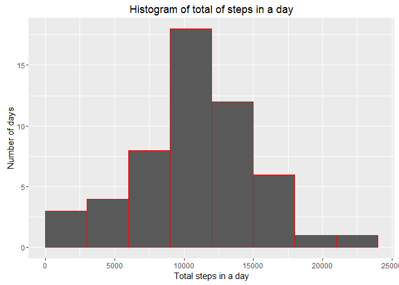
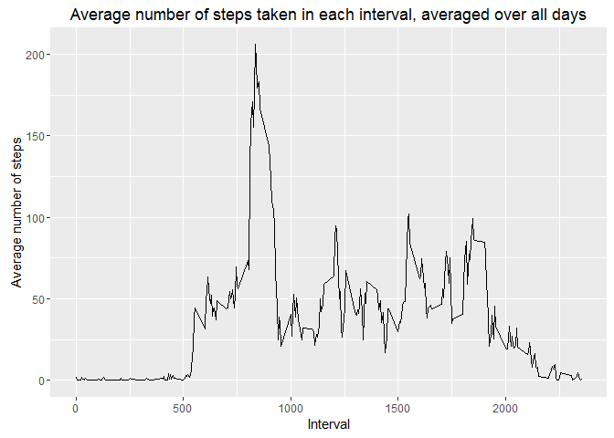
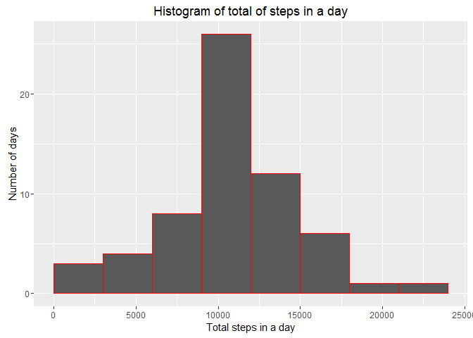
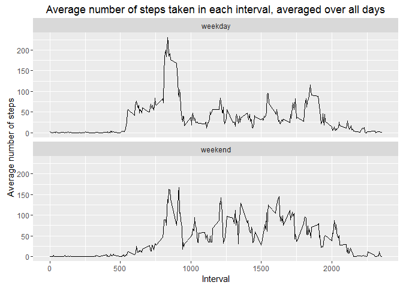

# Reproducible Research: Peer Assessment 1

## Loading and preprocessing the data

```r
options(scipen=999)
library(dplyr)
library(ggplot2)
unzip("activity.zip")
activity_data <- read.csv("activity.csv")
```


## What is mean total number of steps taken per day?
The total number of steps taken per day is:

```r
steps_per_day <- aggregate(list(tot_steps=activity_data$steps), 
                           by=list(date=activity_data$date), 
                           FUN=sum)

steps_per_day
```

```
##          date tot_steps
## 1  2012-10-01        NA
## 2  2012-10-02       126
## 3  2012-10-03     11352
## 4  2012-10-04     12116
## 5  2012-10-05     13294
## 6  2012-10-06     15420
## 7  2012-10-07     11015
## 8  2012-10-08        NA
## 9  2012-10-09     12811
## 10 2012-10-10      9900
## 11 2012-10-11     10304
## 12 2012-10-12     17382
## 13 2012-10-13     12426
## 14 2012-10-14     15098
## 15 2012-10-15     10139
## 16 2012-10-16     15084
## 17 2012-10-17     13452
## 18 2012-10-18     10056
## 19 2012-10-19     11829
## 20 2012-10-20     10395
## 21 2012-10-21      8821
## 22 2012-10-22     13460
## 23 2012-10-23      8918
## 24 2012-10-24      8355
## 25 2012-10-25      2492
## 26 2012-10-26      6778
## 27 2012-10-27     10119
## 28 2012-10-28     11458
## 29 2012-10-29      5018
## 30 2012-10-30      9819
## 31 2012-10-31     15414
## 32 2012-11-01        NA
## 33 2012-11-02     10600
## 34 2012-11-03     10571
## 35 2012-11-04        NA
## 36 2012-11-05     10439
## 37 2012-11-06      8334
## 38 2012-11-07     12883
## 39 2012-11-08      3219
## 40 2012-11-09        NA
## 41 2012-11-10        NA
## 42 2012-11-11     12608
## 43 2012-11-12     10765
## 44 2012-11-13      7336
## 45 2012-11-14        NA
## 46 2012-11-15        41
## 47 2012-11-16      5441
## 48 2012-11-17     14339
## 49 2012-11-18     15110
## 50 2012-11-19      8841
## 51 2012-11-20      4472
## 52 2012-11-21     12787
## 53 2012-11-22     20427
## 54 2012-11-23     21194
## 55 2012-11-24     14478
## 56 2012-11-25     11834
## 57 2012-11-26     11162
## 58 2012-11-27     13646
## 59 2012-11-28     10183
## 60 2012-11-29      7047
## 61 2012-11-30        NA
```

A histogram of the total steps per day is:


```r
library(dplyr)
library(ggplot2)

ggplot(data=steps_per_day, 
       aes(steps_per_day$tot_steps)) + 
  geom_histogram(breaks=seq(0, 25000, by=3000),
                 col="red") + 
  labs(x="Total steps in a day",
       y="Number of days",
       title="Histogram of total of steps in a day")
```

```
## Warning: Removed 8 rows containing non-finite values (stat_bin).
```

<!-- -->

The mean of the total steps per day is: 

```r
summarise(steps_per_day, mean = mean(tot_steps, na.rm = TRUE))
```

```
##       mean
## 1 10766.19
```

The median of the total steps per day is:

```r
summarise(steps_per_day, median = median(tot_steps, na.rm = TRUE))
```

```
##   median
## 1  10765
```

## What is the average daily activity pattern?
The average number of steps taken in 5 minute intervals, averaged over all the days is shown below.


```r
ggplot(activity_data %>% 
         select(steps, interval) %>% 
         group_by(interval) %>% 
         summarise(avg_steps = mean(steps, na.rm = TRUE)), 
       aes(interval,
           avg_steps)) + 
  geom_line() +
  labs(x="Interval", 
       y="Average number of steps", 
       title="Average number of steps taken in each interval, averaged over all days")
```

<!-- -->

The interval with the maximum number of steps is: 

```r
activity_data %>% select(steps, interval) %>% group_by(interval) %>% summarise(avg_steps = mean(steps, na.rm = TRUE)) %>% filter(avg_steps == max(avg_steps)) %>% select(interval)
```

```
## Source: local data frame [1 x 1]
## 
##   interval
##      (int)
## 1      835
```

The average number of steps taken in this interval is:

```r
activity_data %>% select(steps, interval) %>% group_by(interval) %>% summarise(avg_steps = mean(steps, na.rm = TRUE)) %>% filter(avg_steps == max(avg_steps)) %>% select(avg_steps)
```

```
## Source: local data frame [1 x 1]
## 
##   avg_steps
##       (dbl)
## 1  206.1698
```

## Imputing missing values
The total number of missing values in the dataset is:

```r
count(activity_data[which(!complete.cases(activity_data)), ])
```

```
## Source: local data frame [1 x 1]
## 
##       n
##   (int)
## 1  2304
```

Missing values are only in the steps column of the dataset, and only happen for whole days.

We will replace these NA values with the mean for the interval in the days when such data is available.


```r
updated_ad <- activity_data %>%
  group_by(interval) %>%
  mutate(steps = replace(steps, is.na(steps), mean(steps, na.rm = TRUE)))
```

The new total steps per day is:


```r
updated_steps_per_day <- aggregate(list(tot_steps=updated_ad$steps), 
                                   by=list(date=updated_ad$date), 
                                   FUN=sum)

updated_steps_per_day
```

```
##          date tot_steps
## 1  2012-10-01  10766.19
## 2  2012-10-02    126.00
## 3  2012-10-03  11352.00
## 4  2012-10-04  12116.00
## 5  2012-10-05  13294.00
## 6  2012-10-06  15420.00
## 7  2012-10-07  11015.00
## 8  2012-10-08  10766.19
## 9  2012-10-09  12811.00
## 10 2012-10-10   9900.00
## 11 2012-10-11  10304.00
## 12 2012-10-12  17382.00
## 13 2012-10-13  12426.00
## 14 2012-10-14  15098.00
## 15 2012-10-15  10139.00
## 16 2012-10-16  15084.00
## 17 2012-10-17  13452.00
## 18 2012-10-18  10056.00
## 19 2012-10-19  11829.00
## 20 2012-10-20  10395.00
## 21 2012-10-21   8821.00
## 22 2012-10-22  13460.00
## 23 2012-10-23   8918.00
## 24 2012-10-24   8355.00
## 25 2012-10-25   2492.00
## 26 2012-10-26   6778.00
## 27 2012-10-27  10119.00
## 28 2012-10-28  11458.00
## 29 2012-10-29   5018.00
## 30 2012-10-30   9819.00
## 31 2012-10-31  15414.00
## 32 2012-11-01  10766.19
## 33 2012-11-02  10600.00
## 34 2012-11-03  10571.00
## 35 2012-11-04  10766.19
## 36 2012-11-05  10439.00
## 37 2012-11-06   8334.00
## 38 2012-11-07  12883.00
## 39 2012-11-08   3219.00
## 40 2012-11-09  10766.19
## 41 2012-11-10  10766.19
## 42 2012-11-11  12608.00
## 43 2012-11-12  10765.00
## 44 2012-11-13   7336.00
## 45 2012-11-14  10766.19
## 46 2012-11-15     41.00
## 47 2012-11-16   5441.00
## 48 2012-11-17  14339.00
## 49 2012-11-18  15110.00
## 50 2012-11-19   8841.00
## 51 2012-11-20   4472.00
## 52 2012-11-21  12787.00
## 53 2012-11-22  20427.00
## 54 2012-11-23  21194.00
## 55 2012-11-24  14478.00
## 56 2012-11-25  11834.00
## 57 2012-11-26  11162.00
## 58 2012-11-27  13646.00
## 59 2012-11-28  10183.00
## 60 2012-11-29   7047.00
## 61 2012-11-30  10766.19
```

The histogram of steps taken per day now looks as follows:


```r
ggplot(data=(updated_steps_per_day %>% filter(!is.na(tot_steps))), 
       aes((updated_steps_per_day %>% filter(!is.na(tot_steps)))$tot_steps)) + 
  geom_histogram(breaks=seq(0, 25000, by=3000),
                 col="red") + 
  labs(x="Total steps in a day",
       y="Number of days",
       title="Histogram of total of steps in a day")
```

<!-- -->

The mean of the total steps per day is: 

```r
summarise(updated_steps_per_day, mean = mean(tot_steps, na.rm = TRUE))
```

```
##       mean
## 1 10766.19
```

The median of the total steps per day is:

```r
summarise(updated_steps_per_day, median = median(tot_steps, na.rm = TRUE))
```

```
##     median
## 1 10766.19
```


For the days with imputed data, the number of steps is equal to the average value for the other days, i.e. 10766.1886792. Therefore,  the number of days with total steps per day between 9000 and 12000 increases by 8. 

The average does not change, by the definition of average.

The median also becomes 10766.1886792.

## Are there differences in activity patterns between weekdays and weekends?
We first create an extra column indicating whether the day is a weekday or not.


```r
weekend <- c("Saturday", "Sunday")
updated_ad$weekday <- c("Sunday", "Monday", "Tuesday", "Wednesday", "Thursday", 
  "Friday", "Saturday")[as.POSIXlt(updated_ad$date)$wday + 1]
updated_ad$weekday = c('weekday', 'weekend')[(updated_ad$weekday %in% weekend)+1L]
updated_ad$weekday <- factor(updated_ad$weekday)
```

Plotting the difference in average steps between weekday and weekend gives:


```r
ggplot(updated_ad %>% 
         select(steps, interval, weekday) %>% 
         group_by(interval, weekday) %>% 
         summarise(avg_steps = mean(steps, na.rm = TRUE)), 
       aes(interval,
           avg_steps)) + 
  geom_line() +
  labs(x="Interval", 
       y="Average number of steps", 
       title="Average number of steps taken in each interval, averaged over all days") + 
  facet_wrap(~weekday, nrow=2)
```

<!-- -->
